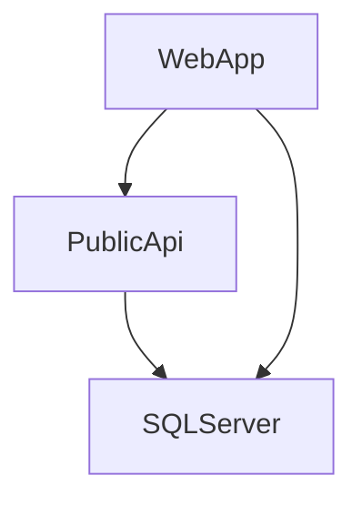

# Openshift Deployment

## Min requirements

1) `oc` Client Version: 4.11.0 and above
2) Openshift Cluster: 4.11 and above

## Introduction

We have to deploy 3 components for deployment of Eshop on web in Openshift. We will show both strategy deploying via s2i and docker.

:small_blue_diamond: SQL server
:small_blue_diamond: Public API
:small_blue_diamond: Web App


   

   1) Clone this repo and change directory to repo cloned directory.

        ``` 
            git clone  https://github.com/redhat-na-ssa/dotnet-eShopOnWeb.git
            cd dotnet-eShopOnWeb
        ```    
   2) set the namespace as env variable

            export namespace=<<namespace>> 
   3) Create a namespace for deploying the eshop application

            oc new-project $namespace


## 1) SQL Server
   
   ### Deploying the sql server

   ### Execute following commands for deploying SQL server. 
   
   All these commands are available under `openshift/commands.txt` file

   

   Create secret for database credentials. Please make sure the <<PASSWORD>> value must comply with sqlserve password polovy restrictions https://learn.microsoft.com/en-us/sql/relational-databases/security/password-policy?view=sql-server-ver16#password-complexity

        export PASSWORD=<<PASSWORD>>

        oc create secret generic mssql --from-literal=SA_PASSWORD="$PASSWORD" -n $namespace

   Create Service account for database server and provide privileges     
   
        oc create serviceaccount sqlserver-sa -n $namespace
        oc adm policy add-scc-to-user anyuid -z sqlserver-sa -n $namespace

   Create PVC and Deployment to deploy SQL server 

        oc create -f openshift/sql-server/pvc.yaml -n $namespace
        oc create -f openshift/sql-server/Deployment.yaml -n $namespace

   Create Service for SQL server

        oc expose deployment/sqlserver -n $namespace

                   --- or ---

        oc apply -f openshift/sql-server/Service.yaml  -n $namespace 


## S2I Demo

 ### Public API.

 ### Create Configmap

        sed 's/CHANGE_DB_PASSWORD/'"$PASSWORD"'/g' openshift/publicApi/assets/appsettings.json > ./openshift/publicApi/assets/appsettings-passwordupdated.json
        oc create cm  appsettings-cm  --from-file=appsettings.json=openshift/publicApi/assets/appsettings-passwordupdated.json
        
          ------- or --------

        sed 's/CHANGE_DB_PASSWORD/'"$PASSWORD"'/g' openshift/publicApi/configmap.yaml > openshift/publicApi/configmap-passwordupdated.yaml
        oc create -f openshift/publicApi/configmap-passwordupdated.yaml


### Import image as image stream
       
        oc import-image dotnet:7.0-ubi8 --from=registry.redhat.io/rhel8/dotnet-70:7.0-12 --confirm

### Deploy new app

Since we are building this project from repo home directory we need to specify s2i process to build specific project this can be achieved via build-env variable `DOTNET_STARTUP_PROJECT` . This variable should point to `.csproj` extension file. Please refer the following [documentation](https://github.com/redhat-developer/s2i-dotnetcore/tree/main/7.0/build#environment-variables) for more references. The other variable `ASPNETCORE_URLS` is a runtime variable which is used for deciding which port the service will serve.

        oc new-app dotnet:7.0-ubi8~https://github.com/arunhari82/dotnet-eShopOnWeb.git --name public-api --build-env DOTNET_STARTUP_PROJECT=src/PublicApi/PublicApi.csproj -e ASPNETCORE_URLS='http://+:8080' --strategy=source

### Mount the volume 

       oc set volume deployment/public-api --add --name appsettings-vol --mount-path /opt/app-root/app/appsettings.json --configmap-name=appsettings-cm --sub-path=appsettings.json
       
       
### Wait for the build to complete by watching logs.

       oc logs -f bc/public-api


## Web App. 

### Deploy new app

      oc new-app dotnet:7.0-ubi8~https://github.com/arunhari82/dotnet-eShopOnWeb.git --name web-app --build-env DOTNET_STARTUP_PROJECT=src/Web/Web.csproj -e ASPNETCORE_URLS='http://+:8080' --strategy=source

### Mount the volume       

      oc set volume deployment/web-app --add --name appsettings-vol --mount-path /opt/app-root/app/appsettings.json --configmap-name=appsettings-cm --sub-path=appsettings.json
      
      
### Wait for the build to complete by watching logs.

       oc logs -f bc/web-app      


### Create a route to serve webapp.   

      oc create route edge --service=web-app


## Docker Demo

Install SQL Server which is a Prerequisite. This deployment uses a variation of Dockerfile to remove the requirement of privileged container This updated file is stored as `Dockerfile.OpenShift` under respective projects.

 ### Public API :

 Use Import from Git from Console. Select the following
 Dockerfile Path as `src/PublicApi/Dockerfile.OpenShift`. 
 Application Name as `docker-demo`
 Name as `public-api`
 Uncheck Create Route
 Port as 8080
 Under Deployment set the environment variable (runtime) `ASPNETCORE_URLS` as `http://+:8080`

 Please refer screenshot below

  
 

 ### Create Configmap

        sed 's/CHANGE_DB_PASSWORD/'"$PASSWORD"'/g' openshift/publicApi/assets/appsettings.json > ./openshift/publicApi/assets/appsettings-passwordupdated.json
        oc create cm  appsettings-cm  --from-file=appsettings.json=openshift/publicApi/assets/appsettings-passwordupdated.json
        
          ------- or --------

        sed 's/CHANGE_DB_PASSWORD/'"$PASSWORD"'/g' openshift/publicApi/configmap.yaml > openshift/publicApi/configmap-passwordupdated.yaml
        oc create -f openshift/publicApi/configmap-passwordupdated.yaml

### Mount the volume 

       oc set volume deployment/public-api --add --name appsettings-vol --mount-path /app/appsettings.json --configmap-name=appsettings-cm --sub-path=appsettings.json
        


### Web App :

 Use Import from Git from Console. Select the following
 Dockerfile Path as `src/Web/Dockerfile.OpenShift`. 
 Application Name as `docker-demo`
 Name as `web-app`
 Port as 8080
 Under Deployment set the environment variable (runtime) `ASPNETCORE_URLS` as `http://+:8080`

 Please refer screenshot below

  
 


### Mount the volume 

       oc set volume deployment/web-app --add --name appsettings-vol --mount-path /app/appsettings.json --configmap-name=appsettings-cm --sub-path=appsettings.json
        

 
